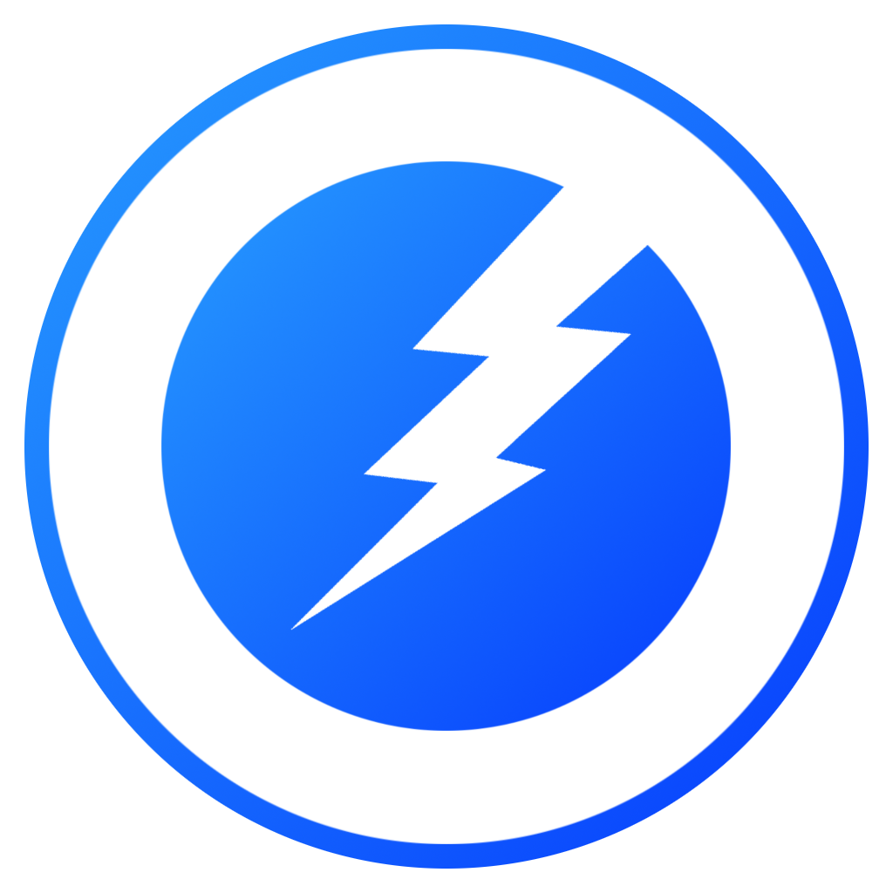
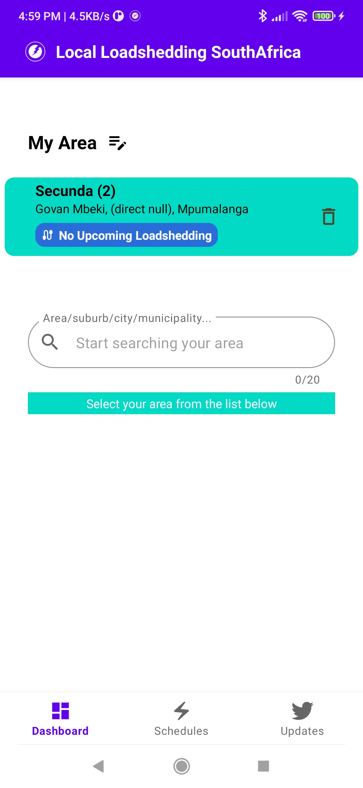
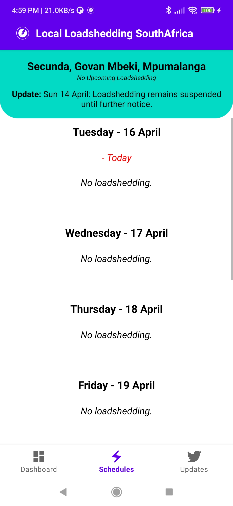
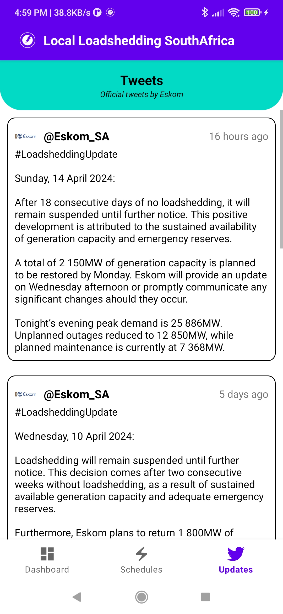

<!-- Zphisher -->

  

<h3>
Local Loadshedding SouthAfrica (LLS)
</h3>

  

  
  
  
  

<b>A straight forward loadshedding app</b>

##

### Download

[Download the app here](https://github.com/InevitablePG/Local-Loadshedding/raw/main/app-release.apk)

##

<h3>
Disclaimer
</h3>

<i><b>Local Loadshedding SouthAfrica</b> is independently developed by me, and is in no way associated with Eskom or any municipal power providers. All schedules, statuses and data is are sourced from publicly available information on the internet. Should you have any issues with the app you should report it on the issues page.</i>

##

### Overview (Screen Shots)

  
  
  

##

##
### Find Me on:

  
  
  

<!-- // -->
